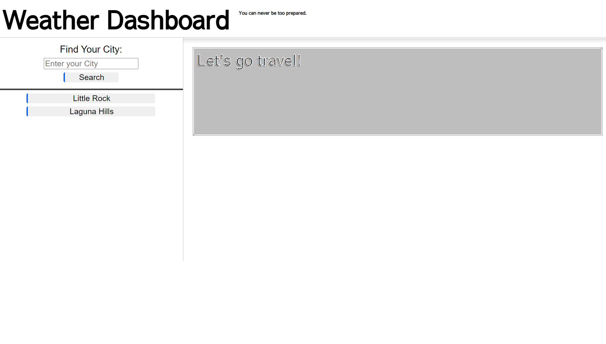

# Weather Dashboard

This assignment was focused on creating a page that works as a weather dashboard for travelers, pulling information from the OpenWeather One Call API to populate the weather cards.

## About the Project

Initially, the page was going to add cards to the flexbox below the current weather after the conditions for the search were fulfilled. The goal was reached, but with very visible errors.

To the left is a search form where the user enters in a city (with, optionally, the abbreviation for either state(U.S.A) or country (global)). Clicking the search will highlight it and push a button into the search history below the form, which when pressed will work in a similar fashion to if the user entered the name on their own.

Known bugs include local storage being overwritten when another city is input after refresh, causing any searches from the previous instance to be replaced by the newer searches. Another being that the appendChild loop will cause an extra child to be created beyond the edge of the screen.

Inputting a city into the form will cause it to populate the cards with the weather for the current day, and five days of the week starting from the day after the current date.

## Tools

* OpenWeather API
    - Geocoding API
    - One Call API

## Screenshots

